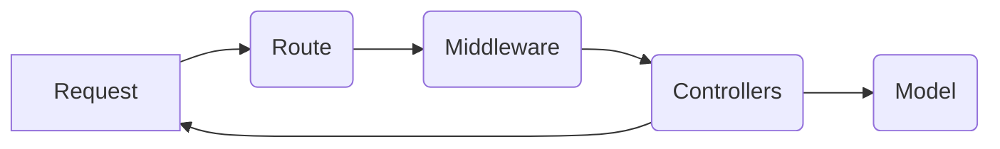

# E-voting Project Documentation

## Description

E-voting adalah sebuah aplikasi berbasis web untuk pemilihan atau pemungutan suara online yang dikembangkan untuk lingkungan sekolah. Aplikasi ini bertujuan untuk memudahkan proses voting dengan menyediakan antarmuka yang aman, mudah diakses, dan dapat diandalkan. Dengan E-voting, siswa dan staf dapat memberikan suara secara online untuk berbagai kegiatan pemilihan, seperti pemilihan ketua OSIS atau perwakilan lainnya. Proyek ini dikembangkan menggunakan framework Laravel, yang menawarkan fitur MVC (Model-View-Controller) yang memungkinkan pengembangan aplikasi berbasis web yang modular dan terstruktur.

## Architecture

E-voting dibangun dengan pendekatan arsitektur MVC (Model-View-Controller) yang disediakan oleh Laravel. Struktur folder disusun untuk memisahkan logika aplikasi, antarmuka pengguna, dan data, dengan tujuan meningkatkan skalabilitas dan mempermudah pemeliharaan.

Berikut adalah struktur utama dari aplikasi:

- **app**: Menyimpan logika aplikasi seperti model dan controller.
- **routes**: Menyimpan file routing yang mendefinisikan endpoint aplikasi.
- **resources/views**: Berisi file blade template yang bertindak sebagai antarmuka pengguna.
- **public**: Direktori yang berisi file yang dapat diakses langsung, seperti gambar dan file JavaScript/CSS.

Flow dari aplikasi mengikuti diagram berikut, di mana setiap permintaan (Request) diproses melalui beberapa tahap sebelum data akhirnya dikembalikan kepada pengguna:



### Configuration & Setup

Untuk menjalankan aplikasi E-voting ini, beberapa konfigurasi dasar perlu disesuaikan pada file `.env`. Berikut adalah konfigurasi utama yang diperlukan:

- **Database**: Setelan untuk koneksi database, termasuk `DB_DATABASE`, `DB_USERNAME`, dan `DB_PASSWORD`.
- **Filesystem**: Konfigurasi untuk penyimpanan file yang mendukung berbagai disk penyimpanan, seperti `local`, `public`, atau `s3`. Pastikan untuk mengatur `FILESYSTEM_DISK` di `.env`, misalnya:
  ```dotenv
  FILESYSTEM_DISK=public
  ```

Aplikasi ini menggunakan beberapa library penting yang kompatibel dengan Laravel versi terbaru untuk mendukung fitur e-voting.

## Installation

Untuk menginstal dan menjalankan aplikasi ini, ikuti langkah-langkah berikut:

```bash
git clone https://github.com/NaraMizaru/evoting-2.0.git
cd evoting-2.0
composer install
cp .env.example .env
php artisan key:generate
php artisan migrate:fresh --seed
php artisan serve
```

## Maintenance & Troubleshooting

### Maintenance

Untuk menjaga aplikasi tetap berjalan dengan baik, berikut adalah beberapa tindakan pemeliharaan yang perlu dilakukan secara rutin:

- **Backup Database**: Buat backup database secara berkala untuk menghindari kehilangan data. Anda dapat menggunakan fitur backup otomatis atau membuat skrip backup yang dijalankan melalui cron job.
- **Log Monitoring**: Periksa file log aplikasi yang terletak di `storage/logs/laravel.log` secara berkala untuk mengidentifikasi error atau peringatan yang memerlukan tindakan.
- **Update Dependencies**: Pastikan untuk selalu menggunakan versi terbaru dari Laravel dan library lain yang digunakan, terutama ketika ada pembaruan keamanan.
- **Optimize Cache**: Jalankan `php artisan optimize` dan `php artisan config:cache` untuk mengoptimalkan kinerja cache dan konfigurasi aplikasi.

### Troubleshooting

Beberapa masalah umum dan solusi yang mungkin membantu:

1. **500 Internal Server Error**:

   - Periksa file `.env` untuk memastikan konfigurasi, terutama pada bagian `APP_KEY`, `DB_CONNECTION`, `DB_DATABASE`, `DB_USERNAME`, dan `DB_PASSWORD`, sudah benar.
   - Jalankan `php artisan config:cache` untuk memastikan cache konfigurasi diperbarui setelah melakukan perubahan di `.env`.

2. **Error saat Menjalankan Composer Install**:

   - Jika muncul pesan error terkait dependensi, coba jalankan `composer update` untuk memperbarui versi library yang kompatibel.
   - Pastikan versi PHP yang terpasang kompatibel dengan versi Laravel dan library yang digunakan.

3. **Cache Tidak Diperbarui**:

   - Untuk memastikan perubahan dalam aplikasi diterapkan, jalankan perintah berikut untuk membersihkan dan mengoptimalkan cache:
     ```bash
     php artisan cache:clear
     php artisan view:clear
     php artisan route:clear
     php artisan config:clear
     php artisan optimize
     ```

4. **Migrasi Database Gagal**:

   - Jika perintah `php artisan migrate` mengalami error, periksa apakah database telah diinisialisasi dan kredensial pada file `.env` sudah benar.
   - Jika tabel sudah ada dan Anda mencoba menambahkan kolom baru, gunakan `php artisan migrate:fresh` untuk memulai migrasi dari awal (peringatan: ini akan menghapus data lama).

5. **Error di Saat Menjalankan Storage atau Filesystem**:
   - Pastikan disk penyimpanan yang dikonfigurasi pada `FILESYSTEM_DISK` di `.env` sudah benar. Jika menggunakan `public`, jalankan `php artisan storage:link` untuk membuat symbolic link ke `public/storage`.
   - Periksa konfigurasi `FILESYSTEM_DISK` jika menggunakan layanan eksternal seperti S3.

Dengan panduan di atas, Anda diharapkan dapat menjaga aplikasi E-voting tetap berjalan optimal dan mengatasi masalah umum yang mungkin muncul.

## References

Berikut adalah sumber-sumber referensi yang berguna untuk pengembangan dan pemeliharaan aplikasi E-voting:

- [Laravel Documentation](https://laravel.com/docs): Dokumentasi resmi Laravel untuk referensi terkait berbagai fitur, konfigurasi, dan panduan penggunaan.
- [Mermaid Documentation](https://mermaid-js.github.io/mermaid): Dokumentasi untuk Mermaid, alat diagram yang digunakan untuk membuat diagram arsitektur.
- [PHP Documentation](https://www.php.net/docs.php): Dokumentasi resmi PHP untuk informasi lebih lanjut terkait penggunaan dan fungsi PHP.
- [Composer Documentation](https://getcomposer.org/doc/): Panduan penggunaan Composer, manajer dependensi PHP, yang digunakan untuk mengelola library di Laravel.
- [DigitalOcean: How to Deploy Laravel Applications](https://www.digitalocean.com/community/tutorials): Kumpulan tutorial untuk meng-host aplikasi Laravel dan panduan konfigurasi server.
- [GitHub Laravel Filesystem Documentation](https://github.com/laravel/docs/blob/10.x/filesystem.md): Dokumentasi terkait konfigurasi dan penggunaan Filesystem di Laravel, termasuk cara integrasi dengan layanan seperti S3.
- [SB Admin 2 for Laravel](https://github.com/aleckrh/laravel-sb-admin-2): Repository GitHub untuk menggunakan template SB Admin 2 dalam proyek Laravel, yang menyediakan desain responsif dan fungsionalitas yang dibutuhkan untuk antarmuka pengguna aplikasi.

Referensi-referensi ini dapat membantu dalam mengelola dan memperdalam pemahaman mengenai aplikasi E-voting dan teknologi pendukungnya.
